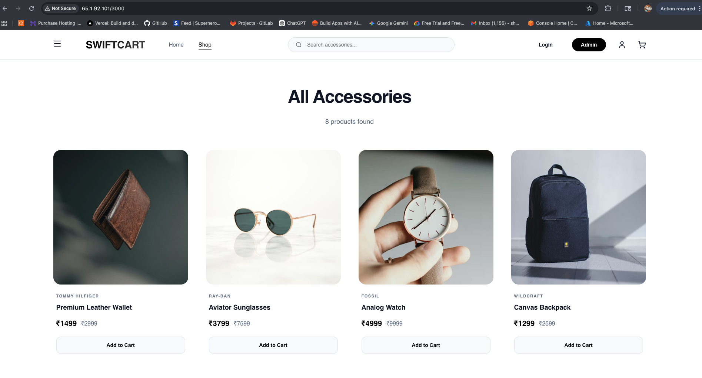
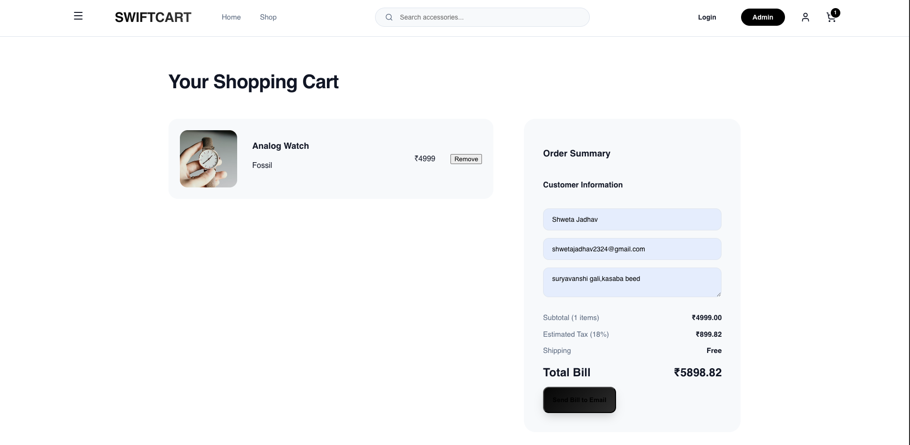
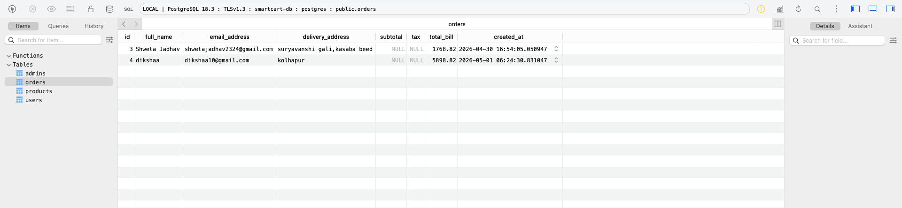
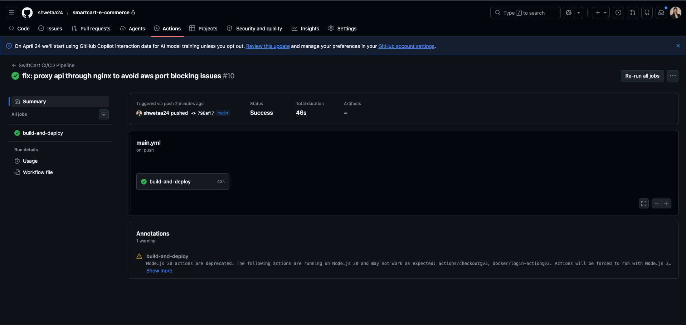

# SwiftCart — Full-Stack E-Commerce

SwiftCart is a premium, full-stack e-commerce solution featuring a React frontend, Node.js backend, and PostgreSQL database. It is fully containerized and features an automated CI/CD pipeline for AWS deployment.

---

## Features
- **Seamless Shopping**: Product catalog, interactive cart, and automated checkout.
- **Admin Dashboard**: Real-time monitoring of users and orders.
- **Automated Deploy**: CI/CD via GitHub Actions to AWS EC2.
- **Database Integrated**: Persistent storage with AWS RDS (PostgreSQL).

---

## Project Showcase

### 1. Live Product Gallery (EC2)

*A high-performance product catalog built with React, deployed and accessible on AWS EC2.*

### 2. Interactive Checkout & Billing System

*Streamlined shopping experience featuring dynamic cart management and automated tax calculations.*

### 3. AWS RDS PostgreSQL Database Management

*Robust data persistence showcasing real-time order storage and relational database integrity.*

### 4. Automated CI/CD Pipeline (GitHub Actions)

*Full-stack deployment workflow utilizing GitHub Actions and Docker to automate EC2 updates.*

---

## Technology Stack
- **Frontend**: React 19, Vite, Lucide React
- **Backend**: Node.js, Express, PostgreSQL (pg)
- **Infrastructure**: AWS (EC2, RDS), Docker, Nginx
- **DevOps**: GitHub Actions (CI/CD)

---

## Quick Start

### 1. Configure Environment
Create `backend/.env`:
```env
DB_USER=postgres
DB_PASSWORD=your_password
DB_HOST=your-rds-endpoint.amazonaws.com
DB_NAME=postgres
DB_PORT=5432
```

### 2. Run with Docker (Recommended)
```bash
# Build and start services
docker compose -f docker-compose.build.yml up -d --build
```
- **App**: http://localhost:3000
- **API**: http://localhost:5002

### 3. Local Development
**Backend:** `cd backend && npm install && npm start` (Port 5001)  
**Frontend:** `cd frontend && npm install && npm run dev` (Port 5173)

---

## CI/CD & Deployment
This project uses **GitHub Actions** for automated deployment. Every push to `main` triggers:
1. **Docker Build**: Frontend and Backend images built and pushed to Docker Hub.
2. **EC2 Deployment**: Automated SSH script updates containers on the AWS instance.

**Required Secrets:** `DOCKERHUB_USERNAME`, `DOCKERHUB_TOKEN`, `EC2_HOST`, `EC2_SSH_KEY`, `DB_HOST`, `DB_PASSWORD`.

---

## Admin Panel
- **URL**: Accessible via the "Admin" button in the navigation.
- **Default Credentials**: `admin@swiftcart.com` / `admin123`

---

**Developed by Shweta Jadhav**
